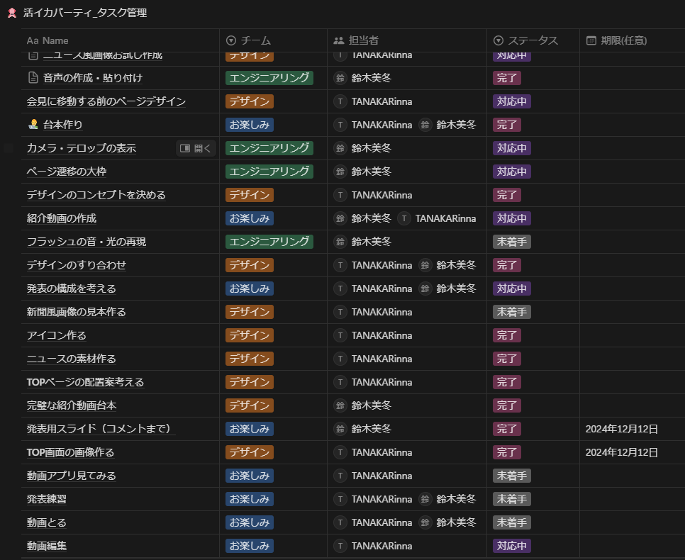

# P2HACKS2024 アピールシート 

プロダクト名  
... フラ会

コンセプト  
...  
日常のどんな瞬間も会見に。\
たくさんのフラッシュを浴びながら出来事を深堀りし、新鮮な感情を保存しよう。

対象ユーザ  
...  ・その瞬間に起きた出来事を深堀りしたい人\
・過去の新鮮な感情を保存して見返したい人\
・たくさんのフラッシュを浴びながら会見を開きたい人！!

利用の流れ  
...  何か出来事が起こった瞬間にフラ会を起動!!

推しポイント  
... しょうもないことから重大なことまで、何か出来事が起こったその瞬間に使うことができる！\
記者に質問してもらうことより、その瞬間の感情が引き出されるとともに、起こった出来事を深堀りできる！\
いつでもその会見を新聞画像とともに見返すことができる！

スクリーンショット(任意) 
 

## 開発体制  

役割分担  
...  鈴木美冬 : コーディング、台本\
田中琳菜 : デザイン、動画\
二人 : その他アイディア出しから発表準備まで...\
2人で沢山相談しながら、できることから頑張った！！

開発における工夫した点  
...  対面でたくさん話し合いながら作業した。臆せずに意見を出した。わからないことがたくさんあったので、その都度調べたり、聞いたりして一生懸命取り組んだ。初心者なりにかけるところからコードを書いた。​実際に使うときの状況を考えながらデザインをした。\
楽しく開発した！！!

## 開発技術 

利用したプログラミング言語  
...  Processing

利用したフレームワーク・ライブラリ  
...  minim、processing.video

その他開発に使用したツール・サービス
...  Figma、アイビスペイント、Notion(タスク管理に使用)、PowerPoint(アプリの構想、台本作り、スライド作り)、CollaNote(デザインの構想)、LINE、Discord、CapCut、GitHub、ChatGPT、Visual Studio Code、ボイスメモ、Next.js(第三章で断念)\
PowerPoint(アプリの構想用)のURL : https://x.gd/ZOaJP\
Notion(タスク管理) : 

## 外部のGitHub
https://github.com/tanakarinna/p2mifu-rin